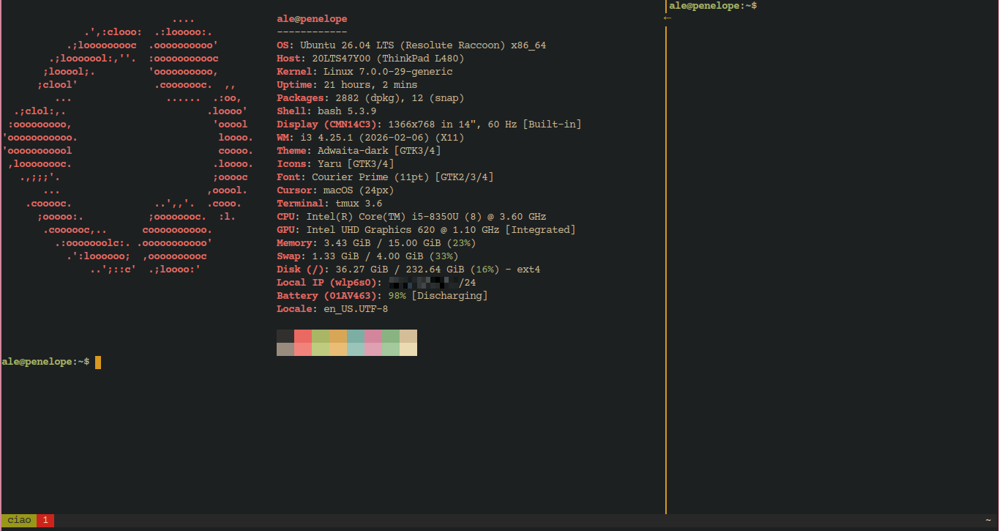

# .tmuxrc

My personal [tmux](https://github.com/tmux/tmux) configuration — vim-style
navigation, mouse support, clipboard integration, and the
[Dracula](https://github.com/dracula/tmux) theme with a Gruvbox color palette.



## On its own, or as part of best-linux-environment

Both work, and this repo is written not to care which one ran it.

**On its own** — clone it, run [`install.sh`](./install.sh), done. That script
owns every tmux-specific step (apt deps, `~/.tmux.conf`, TPM, the plugins, the
agent-status wiring); nothing outside this repo is needed.

**As part of a whole machine** —
[**best-linux-environment**](https://github.com/Spuppateddu/best-linux-environment)
sets up an entire Ubuntu box, and this is one of the config repos it manages.
Its `./setup.sh` clones this one into `~/linux-configuration/tmux`, leaves
`~/.tmuxrc` behind as a symlink to it, and then calls this repo's own
`install.sh` — the same script, doing the same work. It also keeps it pulled and
re-applied at every boot, re-sourcing the config into every running tmux server
so a change pushed from another machine is live without a restart.

## Requirements

- `tmux` **3.2 or newer** — the config uses `terminal-features`,
  `pane-border-lines` and `pane-border-indicators`, all added in 3.2.
  **3.3+** to keep the checkout anywhere other than `~/.tmuxrc`: the config
  locates its own scripts through `#{current_file}`, which older tmux expands
  empty and then falls back to `~/.tmuxrc`
- [TPM](https://github.com/tmux-plugins/tpm) — the tmux plugin manager
- `git` — to clone TPM and the plugins
- `xclip` — for copying to the system clipboard
- `jq` — only for the AI-agent status wiring in `install.sh`

## Install

Clone the repo anywhere (`~/.tmuxrc` by convention) and run the installer:

```sh
git clone <repo-url> ~/.tmuxrc
~/.tmuxrc/install.sh
```

It installs the apt dependencies, points `~/.tmux.conf` at this config, clones
TPM, installs the plugins, reloads a running server, and wires up the AI-agent
status markers below. It is idempotent, merges into your existing config rather
than overwriting it, and takes `--dry-run` to show what it would do.

<details>
<summary>Or do it by hand</summary>

1. Point your `~/.tmux.conf` at this config (create the file if it doesn't exist):

   ```sh
   echo 'source-file ~/.tmuxrc/config' >> ~/.tmux.conf
   ```

2. Install TPM:

   ```sh
   git clone https://github.com/tmux-plugins/tpm ~/.tmux/plugins/tpm
   ```

3. Start tmux and install the plugins by pressing the prefix followed by
   <kbd>I</kbd> (capital i):

   ```
   ` + I
   ```

</details>

## Window names

Windows are named after whatever runs in the active pane — `vim`, `lazygit`,
`claude` — with tools that run under an interpreter resolved to their real name
rather than showing up as `node` or `python`. `scripts/name_windows.sh` re-checks
every two seconds, driven from the status line (`status-interval`).

A window that is only a shell prompt has nothing to announce, so its tab shows
just the number:

```
 1  2 vim  3 claude
```

The window still *carries* the name (`zsh` shows up in `prefix` + <kbd>w</kbd>);
the tab is what leaves it out. `name_windows.sh` sets the window's
`@name_hidden` option and `scripts/tab_format.sh` rewrites dracula's
`window-status-format` and `window-status-current-format` to honour it — as a
rewrite rather than a fresh format, so the theme's colors are never duplicated
here. A name you chose yourself is always shown, and so is an agent marker: it
lives *in* the name, so hiding the name would hide the marker too (a window at a
shell prompt with an agent working in a background split reads `1 [~] zsh`).

Nothing else should rename windows. A `chpwd` hook that names the window after
the current directory — a common shell snippet — both hides what is running and
looks like a manual rename to the namer, which then backs off permanently. The
status line already shows the cwd.

Renaming a window yourself (`prefix` + <kbd>,</kbd>) wins: the script records the
last name it set in the window's `@auto_name` option and stops touching a window
whose name no longer matches. To hand a window back to automatic naming:

```sh
tmux setw -u @auto_name
```

## AI-agent status markers

Windows running an AI agent get a checkbox marker on the tab:

| Marker | Color | Meaning |
| --- | --- | --- |
| `[~]` | bright blue `#83A598` | working |
| `[ ]` | bright orange `#FE8019` | waiting for your input (permission / prompt) |
| `[x]` | bright green `#B8BB26` | finished its turn |

The state is in the glyph, so it reads the same whether or not you can pick the
color out of a busy status line. Color stays on as a redundant cue, drawn by
tmux (`#[fg=...]`) rather than as a colored emoji, so it shows up in urxvt —
which renders emoji monochrome.

Two halves make it work, and `./install.sh` sets up both:

- **Painting** — `scripts/name_windows.sh` reads the `@agent_state` pane option
  and prepends the marker. The window name comes from the active pane, but the
  marker covers **every** pane in the window, so an agent working in a
  background split still shows up. A window holding several agents shows the
  most urgent state: `[ ]` if any is blocked on you, else `[~]` if any is still
  working, and `[x]` only once they're all done.
- **Reporting** — the agent calls `scripts/agent_state.sh <busy|wait|done|clear>`,
  which sets `@agent_state` on its own pane (via the inherited `$TMUX_PANE`).
  This half lives in each agent's own config, outside this repo:

  | Agent | Wired into | Source of truth |
  | --- | --- | --- |
  | Claude Code | `~/.claude/settings.json` hooks | `agents/claude-hooks.json` |
  | opencode | `~/.config/opencode/plugins/tmux-status.js` | `agents/opencode-tmux-status.js` |

  Claude Code's `Notification` hook goes through `scripts/agent_notify.sh`
  rather than straight to `agent_state.sh`: that one event fires both for
  "needs your permission" *and* for the idle nudge ~60s **after** a turn ends,
  and treating the second as "waiting" would quietly flip a finished `[x]`
  window back to `[ ]`. opencode needs no such split — it has a real
  `permission.asked` event.

`install.sh` only wires an agent it finds installed, merges into existing config
rather than overwriting it (your own hooks survive), and is safe to re-run.
**Don't edit the installed copies** — edit the files under `agents/` and re-run
`./install.sh`.

## Key bindings

The **prefix** key is the backtick <kbd>`</kbd>. Note that it is bound to
`last-window` rather than `send-prefix`, so there is no key that types a literal
backtick inside tmux — paste one if you need it.

| Binding | Action |
| --- | --- |
| `` ` `` | Prefix |
| `` ` `` `` ` `` | Jump to last window |
| `prefix` + `u` | Clear screen and scrollback history |
| `prefix` + `h/j/k/l` | Move between panes (vim-style) |
| `Ctrl+Shift+Arrows` | Resize the current pane |
| `prefix` + `"` | Split into top/bottom panes (tmux `-v`, same directory) |
| `prefix` + `%` | Split into left/right panes (tmux `-h`, same directory) |
| `prefix` + `c` | New window (same directory) |
| `prefix` + `z` | Kill the current pane (replaces tmux's default pane **zoom**, which is left unbound) |
| `prefix` + `x` | Kill the current window (no confirm prompt) |
| `y` (copy-mode) | Copy selection to system clipboard |

## Plugins

- [tpm](https://github.com/tmux-plugins/tpm) — plugin manager
- [tmux-sensible](https://github.com/tmux-plugins/tmux-sensible) — sane defaults
- [vim-tmux-navigator](https://github.com/christoomey/vim-tmux-navigator) — seamless vim ↔ tmux pane navigation
- [dracula/tmux](https://github.com/dracula/tmux) — status bar theme. Always
  shows the working directory; CPU, RAM and the SSH-session name are added only
  when the tmux server was started from an SSH login, since on the local machine
  they're already known.
